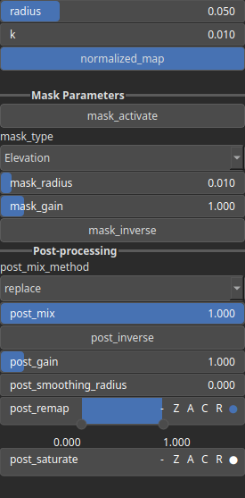

SmoothFill Node
===============

SmoothFill is a smoothing technique that takes the maximum between the input and the filtered field to simulate a sediment deposition effect.

# Category

Filter/Smoothing
# Inputs

|Name|Type|Description|
| :--- | :--- | :--- |
|input|Heightmap|Input heightmap.|
|mask|Heightmap|Mask defining the filtering intensity (expected in [0, 1]).|

# Outputs

|Name|Type|Description|
| :--- | :--- | :--- |
|deposition|Heightmap|Deposition map (in [0, 1]).|
|output|Heightmap|Filtered heightmap.|

# Parameters

|Name|Type|Description|
| :--- | :--- | :--- |
|GPU|Bool|Toogle GPU acceleration on or off.|
|k|Float|Smoothing intensity of the maximum operator.|
|normalized_map|Bool|Decides if the deposition map is normalized.|
|radius|Float|Filter radius with respect to the domain size.|

# Example

