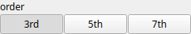

Smoothstep Node
===============

Applies a smoothstep function to the input heightmap, creating a smooth transition between values.

## Category

Math/Base
## Inputs

|Name|Type|Description|
| :--- | :--- | :--- |
|input|VirtualArray|Input heightmap.|

## Outputs

|Name|Type|Description|
| :--- | :--- | :--- |
|output|VirtualArray|Output heightmap with the smoothstep function applied.|

## Parameters

|Name|Type|Description|
| :--- | :--- | :--- |
|order|Choice|The order of the smoothstep function, determining the smoothness of the transition.|

## Example

Corresponding Hesiod file: [Smoothstep.hsd](../../examples/Smoothstep.hsd). Use [Ctrl+I] in the node editor to import a hsd file within your current project.

!!! note
    Example files are kept up-to-date with the latest version of [Hesiod](https://github.com/otto-link/Hesiod).
    If you find an error, please [open an issue](https://github.com/otto-link/Hesiod/issues).

