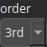

Smoothstep Node
===============

Applies a smoothstep function to the input heightmap, creating a smooth transition between values.

# Category

Math/Base
# Inputs

|Name|Type|Description|
| :--- | :--- | :--- |
|input|Heightmap|Input heightmap.|

# Outputs

|Name|Type|Description|
| :--- | :--- | :--- |
|output|Heightmap|Output heightmap with the smoothstep function applied.|

# Parameters

|Name|Type|Description|
| :--- | :--- | :--- |
|order|Choice|The order of the smoothstep function, determining the smoothness of the transition.|

# Example

No example available.