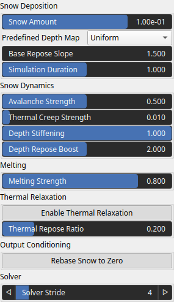
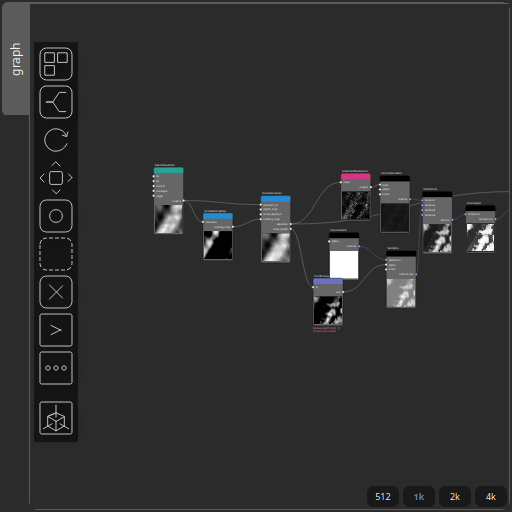

SnowSimulation Node
===================

No description available

# Category

Hydrology
# Inputs

|Name|Type|Description|
| :--- | :--- | :--- |
|depth_map|VirtualArray|Optional depth modulation map controlling spatial variation of snow deposition.|
|elevation_in|VirtualArray|Input terrain elevation used as the base surface for snow simulation.|
|melting_map|VirtualArray|Optional spatial melting factor in [0,1] controlling local snow removal.|
|snow_depth_in|VirtualArray|Optional initial snow thickness used as the starting state of the simulation.|

# Outputs

|Name|Type|Description|
| :--- | :--- | :--- |
|elevation|VirtualArray|Output elevation including terrain and accumulated snow.|
|snow_depth|VirtualArray|Final snow thickness after accumulation, transport, and melting.|

# Parameters

|Name|Type|Description|
| :--- | :--- | :--- |
|Predefined Depth Map|Enumeration|No description|
|Simulation Duration|Float|Total simulated time. Higher values allow snow to settle, creep, and stabilize more.|
|Depth Stiffening|Float|Controls how much snow becomes resistant to motion as depth increases. Higher values make thick snow more stable.|
|Depth Repose Boost|Float|Increases the effective repose angle with snow depth, allowing deep snow to maintain steeper slopes.|
|Melting Strength|Float|Global multiplier for snow melting. Higher values cause snow to thin or disappear faster in melting areas.|
|Avalanche Strength|Float|Controls the speed and intensity of snow avalanches when slopes exceed the repose angle.|
|Thermal Creep Strength|Float|Controls slow, diffusive snow motion below the repose angle, producing smooth, rounded snow surfaces.|
|Enable Thermal Relaxation|Bool|Enables sub-repose thermal smoothing, allowing snow to slowly collapse and relax on gentle slopes.|
|Rebase Snow to Zero|Bool|Shifts the snow field so its minimum value starts at zero while preserving relative snow thickness.|
|Snow Amount|Float|Total amount of snow deposited during the simulation. Controls overall snow coverage and thickness.|
|Solver Stride|Integer|Grid sampling stride used by the solver. Higher values process the snow field at a lower spatial resolution, reducing computation time at the cost of fine detail.|
|Base Repose Slope|Float|Base repose angle of snow. Higher values allow steeper slopes before snow starts to slide.|
|Thermal Repose Ratio|Float|Controls how strongly thermal creep depends on the repose angle. Lower values produce smoother snow on shallow slopes.|

# Example

Corresponding Hesiod file: [SnowSimulation.hsd](../../examples/SnowSimulation.hsd). Use [Ctrl+I] in the node editor to import a hsd file within your current project. 

> **Note:** Example files are kept up-to-date with the latest version of [Hesiod](https://github.com/otto-link/Hesiod).
> If you find an error, please [open an issue](https://github.com/otto-link/Hesiod/issues).

