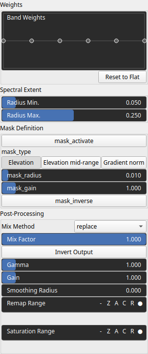

SpectralEqualizer Node
======================

Adjusts the frequency content of the input field by decomposing it into multiple scales and reweighting each frequency band independently. This allows fine control over large structures, medium features, and fine details.

# Category

Filter
# Inputs

|Name|Type|Description|
| :--- | :--- | :--- |
|input|VirtualArray|Input field to be processed.|
|mask|VirtualArray|Optional mask controlling where the effect is applied.|

# Outputs

|Name|Type|Description|
| :--- | :--- | :--- |
|output|VirtualArray|Output field with adjusted spectral content.|

# Parameters

|Name|Type|Description|
| :--- | :--- | :--- |
|Band Weights|Vector of floats|No description|
|mask_activate|Bool|Enables or disables the internal mask. If the node's 'mask' input is connected, this setting is bypassed and the input mask is used instead.|
|mask_gain|Float|Controls the intensity or influence of the internal mask. Bypassed if the 'mask' input is connected.|
|mask_inverse|Bool|Inverts the internal mask, applying the operator where the mask is low. Ignored if a 'mask' input is provided.|
|mask_radius|Float|Defines the smoothing radius for the internal mask. A value of 0 disables smoothing. This is bypassed if the 'mask' input is used.|
|mask_type|Choice|Specifies how the internal mask is computed: 'Elevation' uses height, 'Gradient Norm' uses slope, and 'Elevation mid-range' selects the middle portion of the height range. This parameter is ignored when a 'mask' input is connected.|
|Gain|Float|Mid-centered gain transformation applied to the elevation values. Increasing the gain pushes values toward extremes, flattening low/high regions and steepening transitions.|
|Gamma|Float|Gamma correction applied to the elevation values. Adjusts contrast by emphasizing low or high values without changing ordering.|
|Invert Output|Bool|Inverts the output values after processing, flipping low and high values.|
|Mix Factor|Float|Blending factor between input and processed output. 0 keeps input, 1 uses full output.|
|Mix Method|Enumeration|Method used to combine input and output values (e.g., linear, min, max, add, subtract).|
|Remap Range|Value range|Linearly remaps the output values to a target range.|
|Saturation Range|Value range|Enhances contrast by clamping values to a range and rescaling to the full output interval.|
|Smoothing Radius|Float|Applies additional smoothing to the output. Larger values reduce fine details.|
|Radius Max.|Float|Maximum smoothing radius defining the lowest frequency band. Controls large-scale structures.|
|Radius Min.|Float|Minimum smoothing radius defining the highest frequency band. Controls fine details.|

# Example

No example available.  
