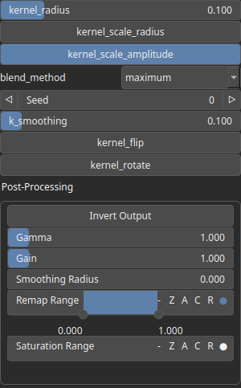

Stamping Node
=============

Stamping .

# Category

Primitive/Coherent
# Inputs

|Name|Type|Description|
| :--- | :--- | :--- |
|cloud|Cloud|Stamping locations and intensities (as a Cloud).|
|kernel|Array|Kernel to be stamped.|

# Outputs

|Name|Type|Description|
| :--- | :--- | :--- |
|output|VirtualArray|Output heightmap.|

# Parameters

|Name|Type|Description|
| :--- | :--- | :--- |
|blend_method|Enumeration|Blending method. Available values: add, maximum, minimum, multiply, substract.|
|k_smoothing|Float|Smoothing parameter (if any).|
|kernel_flip|Bool|Randomly flip, or not, the kernel before stamping (includes tranposing).|
|kernel_radius|Float|Kernel base radius, with respect a unit square domain.|
|kernel_rotate|Bool|Randomly rotate, or not, the kernel before stamping (can be any rotation angle, can also be ressource consuming).|
|kernel_scale_amplitude|Bool|Determine whether the kernel amplitude is scaled with the point values.|
|kernel_scale_radius|Bool|Determine whether the kernel radius is scaled with the point values.|
|Gain|Float|Mid-centered gain transformation applied to the elevation values. This is a non-linear recurve operator centered around the mid elevation (typically 0.5). Increasing the gain pushes values toward the minimum and maximum elevations, creating flatter low/high regions with a steeper transition around the midpoint.|
|Gamma|Float|Standard gamma correction applied to the elevation values. This is a monotonic power-law remapping that shifts emphasis toward low or high elevations, making the overall shape sharper or bulkier without changing its ordering.|
|Invert Output|Bool|Inverts the output values after processing, flipping low and high values across the midrange.|
|Remap Range|Value range|Linearly remaps the output values to a specified target range (default is [0, 1]).|
|Saturation Range|Value range|Modifies the amplitude of elevations by first clamping them to a given interval and then scaling them so that the restricted interval matches the original input range. This enhances contrast in elevation variations while maintaining overall structure.|
|Smoothing Radius|Float|Defines the radius for post-processing smoothing, determining the size of the neighborhood used to average local values and reduce high-frequency detail. A radius of 0 disables smoothing.|
|Seed|Random seed number|Random seed number. The random seed is an offset to the randomized process. A different seed will produce a new result.|

# Example

No example available.  
