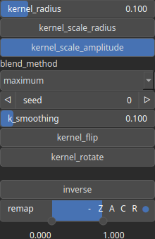

Stamping Node
=============

Stamping .

# Category

Primitive/Coherent
# Inputs

|Name|Type|Description|
| :--- | :--- | :--- |
|cloud|Cloud|Stamping locations and intensities (as a Cloud).|
|kernel|Array|Kernel to be stamped.|

# Outputs

|Name|Type|Description|
| :--- | :--- | :--- |
|output|Heightmap|Output heightmap.|

# Parameters

|Name|Type|Description|
| :--- | :--- | :--- |
|blend_method|Enumeration|Blending method. Available values: add, maximum, minimum, multiply, substract.|
|inverse|Bool|Toggle inversion of the output values.|
|k_smoothing|Float|Smoothing parameter (if any).|
|kernel_flip|Bool|Randomly flip, or not, the kernel before stamping (includes tranposing).|
|kernel_radius|Float|Kernel base radius, with respect a unit square domain.|
|kernel_rotate|Bool|Randomly rotate, or not, the kernel before stamping (can be any rotation angle, can also be ressource consuming).|
|kernel_scale_amplitude|Bool|Determine whether the kernel amplitude is scaled with the point values.|
|kernel_scale_radius|Bool|Determine whether the kernel radius is scaled with the point values.|
|remap|Value range|Remap the operator's output to a specified range, defaulting to [0, 1].|
|seed|Random seed number|Random seed number.|

# Example

