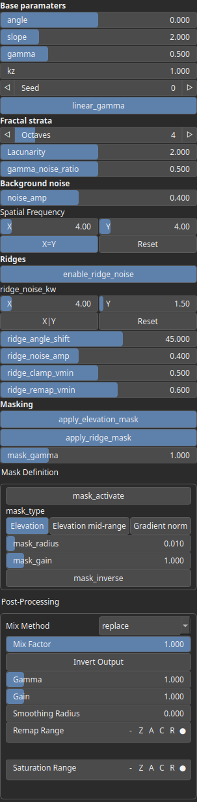
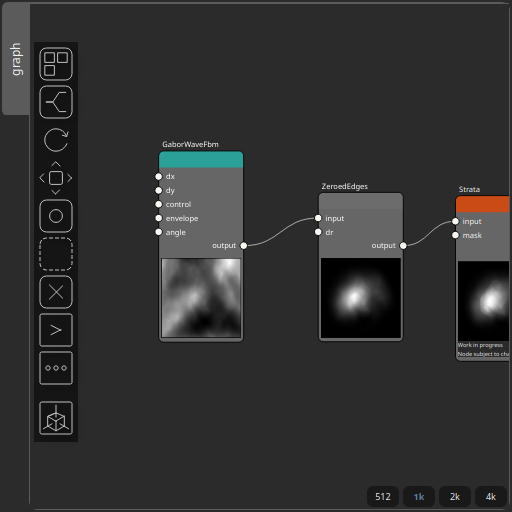
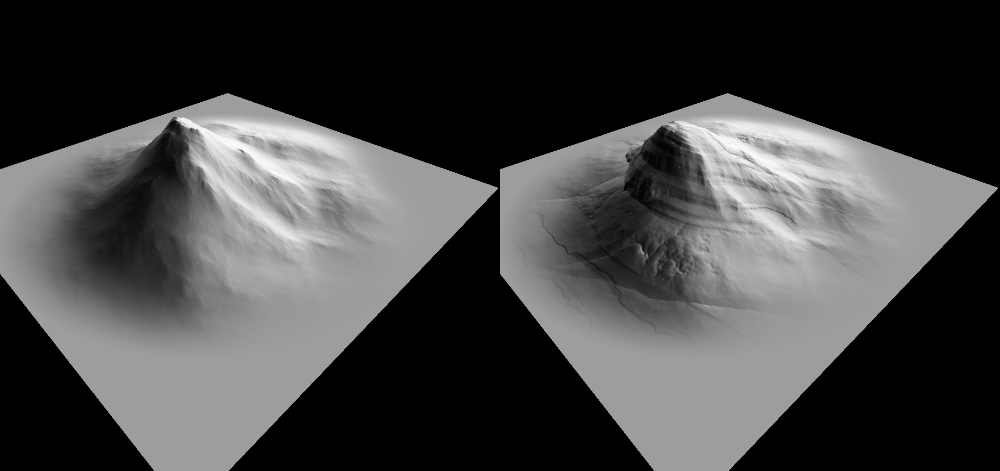

Strata Node
===========

No description available

# Category

Erosion/Stratify
# Inputs

|Name|Type|Description|
| :--- | :--- | :--- |
|input|Heightmap|No description|
|mask|Heightmap|No description|

# Outputs

|Name|Type|Description|
| :--- | :--- | :--- |
|output|Heightmap|No description|

# Parameters

|Name|Type|Description|
| :--- | :--- | :--- |
|angle|Float|No description|
|apply_elevation_mask|Bool|No description|
|apply_ridge_mask|Bool|No description|
|gamma|Float|No description|
|gamma_noise_ratio|Float|No description|
|kz|Float|No description|
|lacunarity|Float|No description|
|linear_gamma|Bool|No description|
|mask_activate|Bool|No description|
|mask_gain|Float|No description|
|mask_gamma|Float|No description|
|mask_inverse|Bool|No description|
|mask_radius|Float|No description|
|mask_type|Choice|No description|
|noise_amp|Float|No description|
|noise_kw|Wavenumber|No description|
|octaves|Integer|No description|
|post_gain|Float|No description|
|post_inverse|Bool|No description|
|post_mix|Float|No description|
|post_mix_method|Enumeration|No description|
|post_remap|Value range|No description|
|post_smoothing_radius|Float|No description|
|ridge_angle_shift|Float|No description|
|ridge_clamp_vmin|Float|No description|
|ridge_noise_amp|Float|No description|
|ridge_noise_kw|Wavenumber|No description|
|ridge_remap_vmin|Float|No description|
|seed|Random seed number|No description|
|slope|Float|No description|

# Example

Corresponding Hesiod file: [Strata.hsd](../../examples/Strata.hsd). Use [Ctrl+I] in the node editor to import a hsd file within your current project. 

> **Note:** Example files are kept up-to-date with the latest version of [Hesiod](https://github.com/otto-link/Hesiod).
> If you find an error, please [open an issue](https://github.com/otto-link/Hesiod/issues).

  
# Screenshots

Before/after:

