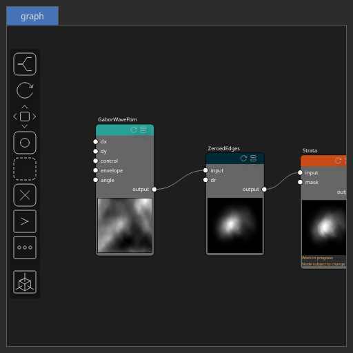

Strata Node
===========

No description available

# Category

Erosion/Stratify
# Inputs

|Name|Type|Description|
| :--- | :--- | :--- |
|input|Heightmap|No description|
|mask|Heightmap|No description|

# Outputs

|Name|Type|Description|
| :--- | :--- | :--- |
|output|Heightmap|No description|

# Parameters

|Name|Type|Description|
| :--- | :--- | :--- |
|angle|Float|No description|
|apply_elevation_mask|Bool|No description|
|apply_ridge_mask|Bool|No description|
|gamma|Float|No description|
|gamma_noise_ratio|Float|No description|
|kz|Float|No description|
|Lacunarity|Float|The frequency scaling factor for successive noise octaves. Higher values increase the frequency of each successive octave.|
|linear_gamma|Bool|No description|
|mask_activate|Bool|No description|
|mask_gain|Float|No description|
|mask_gamma|Float|No description|
|mask_inverse|Bool|No description|
|mask_radius|Float|No description|
|mask_type|Choice|No description|
|noise_amp|Float|No description|
|Spatial Frequency|Wavenumber|No description|
|Octaves|Integer|The number of octaves for fractal noise generation. More octaves add finer details to the terrain.|
|Gain|Float|Set the gain. Gain is a power law transformation altering the distribution of signal values, compressing or expanding certain regions of the signal depending on the exponent of the power law.|
|Invert Output|Bool|Inverts the output values after processing, flipping low and high values across the midrange.|
|Mix Factor|Float|Mixing factor for blending input and output values. A value of 0 uses only the input, 1 uses only the output, and intermediate values perform a linear interpolation.|
|Mix Method|Enumeration|Method used to combine input and output values. Options include linear interpolation (default), min, max, smooth min, smooth max, add, and subtract.|
|Remap Range|Value range|Linearly remaps the output values to a specified target range (default is [0, 1]).|
|Saturation Range|Value range|Modifies the amplitude of elevations by first clamping them to a given interval and then scaling them so that the restricted interval matches the original input range. This enhances contrast in elevation variations while maintaining overall structure.|
|Smoothing Radius|Float|Defines the radius for post-processing smoothing, determining the size of the neighborhood used to average local values and reduce high-frequency detail. A radius of 0 disables smoothing.|
|ridge_angle_shift|Float|No description|
|ridge_clamp_vmin|Float|No description|
|ridge_noise_amp|Float|No description|
|ridge_noise_kw|Wavenumber|No description|
|ridge_remap_vmin|Float|No description|
|Seed|Random seed number|Random seed number. The random seed is an offset to the randomized process. A different seed will produce a new result.|
|slope|Float|No description|

# Example

Corresponding Hesiod file: [Strata.hsd](../../examples/Strata.hsd). Use [Ctrl+I] in the node editor to import a hsd file within your current project. 

> **Note:** Example files are kept up-to-date with the latest version of [Hesiod](https://github.com/otto-link/Hesiod).
> If you find an error, please [open an issue](https://github.com/otto-link/Hesiod/issues).

  
# Screenshots

Before/after:

