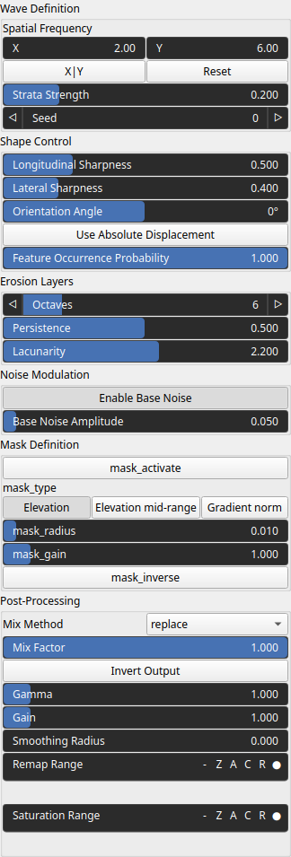
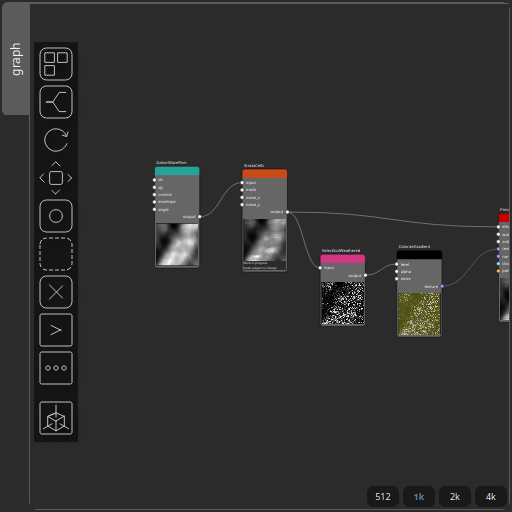

StrataCells Node
================

No description available

# Category

Erosion/Stratify
# Inputs

|Name|Type|Description|
| :--- | :--- | :--- |
|input|VirtualArray|No description|
|mask|VirtualArray|No description|
|noise_x|VirtualArray|No description|
|noise_y|VirtualArray|No description|

# Outputs

|Name|Type|Description|
| :--- | :--- | :--- |
|output|VirtualArray|No description|

# Parameters

|Name|Type|Description|
| :--- | :--- | :--- |
|Use Absolute Displacement|Bool|No description|
|Strata Strength|Float|No description|
|Orientation Angle|Float|No description|
|Enable Base Noise|Bool|No description|
|Longitudinal Sharpness|Float|No description|
|Lateral Sharpness|Float|No description|
|Spatial Frequency|Wavenumber|No description|
|Lacunarity|Float|No description|
|mask_activate|Bool|No description|
|mask_gain|Float|No description|
|mask_inverse|Bool|No description|
|mask_radius|Float|No description|
|mask_type|Choice|No description|
|Base Noise Amplitude|Float|No description|
|Feature Occurrence Probability|Float|No description|
|Octaves|Integer|No description|
|Persistence|Float|No description|
|Gain|Float|No description|
|Gamma|Float|No description|
|Invert Output|Bool|No description|
|Mix Factor|Float|No description|
|Mix Method|Enumeration|No description|
|Remap Range|Value range|No description|
|Saturation Range|Value range|No description|
|Smoothing Radius|Float|No description|
|Seed|Random seed number|No description|

# Example

Corresponding Hesiod file: [StrataCells.hsd](../../examples/StrataCells.hsd). Use [Ctrl+I] in the node editor to import a hsd file within your current project. 

> **Note:** Example files are kept up-to-date with the latest version of [Hesiod](https://github.com/otto-link/Hesiod).
> If you find an error, please [open an issue](https://github.com/otto-link/Hesiod/issues).

