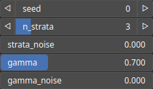

Stratify Node
=============

Stratify adds horizontal stratifications to the input heightmap.

# Category

Erosion/Stratify
# Inputs

|Name|Type|Description|
| :--- | :--- | :--- |
|input|Heightmap|Input heightmap.|
|mask|Heightmap|Mask defining the filtering intensity (expected in [0, 1]).|
|noise|Heightmap|Local elevation noise, value range expected to be scaled with the one of the input heightmap.|

# Outputs

|Name|Type|Description|
| :--- | :--- | :--- |
|output|Heightmap|Eroded heightmap.|

# Parameters

|Name|Type|Description|
| :--- | :--- | :--- |
|gamma|Float|Reference value for the gamma correction applied to each strata, influence the cliff elevation profile.|
|gamma_noise|Float|Noise range for the gamma value.|
|n_strata|Integer|Numbner of strata.|
|seed|Random seed number|Random seed number.|
|strata_noise|Float|Noise range for the strata elevations.|

# Example

No example available.