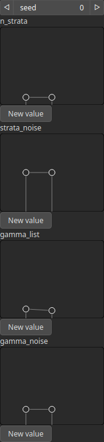

StratifyMultiscale Node
=======================

TODO

# Category

Erosion/Stratify
# Inputs

|Name|Type|Description|
| :--- | :--- | :--- |
|input|Heightmap|TODO|
|mask|Heightmap|Mask defining the filtering intensity (expected in [0, 1]).|
|noise|Heightmap|TODO|

# Outputs

|Name|Type|Description|
| :--- | :--- | :--- |
|output|Heightmap|TODO|

# Parameters

|Name|Type|Description|
| :--- | :--- | :--- |
|gamma_list|Vector of floats|TODO|
|gamma_noise|Vector of floats|TODO|
|n_strata|Vector of integers|TODO|
|seed|Random seed number|TODO|
|strata_noise|Vector of floats|TODO|

# Example

