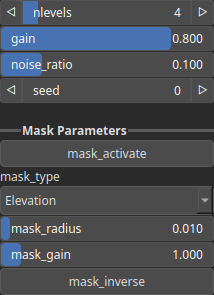

Terrace Node
============

Applies a terracing effect to the input heightmap by quantizing elevation levels into discrete steps, optionally modulated by noise.

# Category

Filter/Recurve
# Inputs

|Name|Type|Description|
| :--- | :--- | :--- |
|input|Heightmap|The input heightmap to be transformed with terrace steps.|
|mask|Heightmap|Mask defining the filtering intensity (expected in [0, 1]).|
|noise|Heightmap|Optional noise map used to perturb the position of the terrace levels for a more natural look.|

# Outputs

|Name|Type|Description|
| :--- | :--- | :--- |
|output|Heightmap|Resulting heightmap after applying the terracing effect.|

# Parameters

|Name|Type|Description|
| :--- | :--- | :--- |
|gain|Float|Controls the amplification of the terrace steps; higher values create steeper transitions between levels.|
|mask_activate|Bool|Enables or disables the internal mask. If the node's 'mask' input is connected, this setting is bypassed and the input mask is used instead.|
|mask_gain|Float|Controls the intensity or influence of the internal mask. Bypassed if the 'mask' input is connected.|
|mask_inverse|Bool|Inverts the internal mask, applying the operator where the mask is low. Ignored if a 'mask' input is provided.|
|mask_radius|Float|Defines the smoothing radius for the internal mask. A value of 0 disables smoothing. This is bypassed if the 'mask' input is used.|
|mask_type|Choice|Specifies how the internal mask is computed: 'Elevation' uses height, 'Gradient Norm' uses slope, and 'Elevation mid-range' selects the middle portion of the height range. This parameter is ignored when a 'mask' input is connected.|
|nlevels|Integer|Number of discrete elevation steps (terraces) to apply to the input heightmap.|
|noise_ratio|Float|Ratio between deterministic and noisy placement of terrace levels; 0 uses only uniform levels, 1 uses full noise-based variation.|
|Seed|Random seed number|Random seed number. The random seed is an offset to the randomized process. A different seed will produce a new result.|

# Example

No example available.