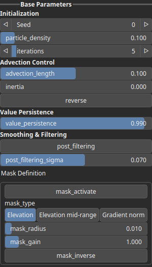

TextureAdvectionParticle Node
=============================

No description available

## Category

Texture
## Inputs

|Name|Type|Description|
| :--- | :--- | :--- |
|advection_mask|VirtualArray|No description|
|elevation|VirtualArray|No description|
|input|VirtualTexture|No description|
|mask|VirtualArray|No description|

## Outputs

|Name|Type|Description|
| :--- | :--- | :--- |
|texture|VirtualTexture|No description|

## Parameters

|Name|Type|Description|
| :--- | :--- | :--- |
|advection_length|Float|No description|
|inertia|Float|No description|
|iterations|Integer|No description|
|Activate Default Mask|Bool|Enables or disables the internal mask. If the node's 'mask' input is connected, this setting is bypassed and the input mask is used instead.|
|Mask Gain|Float|Controls the intensity or influence of the internal mask. Bypassed if the 'mask' input is connected.|
|Inverse Mask|Bool|Inverts the internal mask, applying the operator where the mask is low. Ignored if a 'mask' input is provided.|
|Mask Radius|Float|Defines the smoothing radius for the internal mask. A value of 0 disables smoothing. This is bypassed if the 'mask' input is used.|
|Mask Type|Choice|Specifies how the internal mask is computed: 'Elevation' uses height, 'Gradient Norm' uses slope, and 'Elevation mid-range' selects the middle portion of the height range. This parameter is ignored when a 'mask' input is connected.|
|particle_density|Float|No description|
|post_filtering|Bool|No description|
|post_filtering_sigma|Float|No description|
|reverse|Bool|No description|
|Seed|Random seed number|Random seed number. The random seed is an offset to the randomized process. A different seed will produce a new result.|
|value_persistence|Float|No description|

## Example

Corresponding Hesiod file: [TextureAdvectionParticle.hsd](../../examples/TextureAdvectionParticle.hsd). Use [Ctrl+I] in the node editor to import a hsd file within your current project.

!!! note
    Example files are kept up-to-date with the latest version of [Hesiod](https://github.com/otto-link/Hesiod).
    If you find an error, please [open an issue](https://github.com/otto-link/Hesiod/issues).

