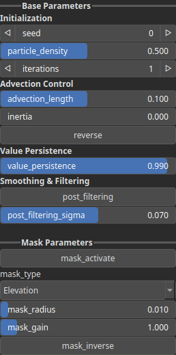

TextureAdvectionParticle Node
=============================

No description available

# Category

Texture
# Inputs

|Name|Type|Description|
| :--- | :--- | :--- |
|advection_mask|Heightmap|No description|
|elevation|Heightmap|No description|
|mask|Heightmap|No description|
|texture|HeightmapRGBA|No description|

# Outputs

|Name|Type|Description|
| :--- | :--- | :--- |
|output|HeightmapRGBA|No description|

# Parameters

|Name|Type|Description|
| :--- | :--- | :--- |
|advection_length|Float|No description|
|inertia|Float|No description|
|iterations|Integer|No description|
|mask_activate|Bool|No description|
|mask_gain|Float|No description|
|mask_inverse|Bool|No description|
|mask_radius|Float|No description|
|mask_type|Choice|No description|
|particle_density|Float|No description|
|post_filtering|Bool|No description|
|post_filtering_sigma|Float|No description|
|reverse|Bool|No description|
|Seed|Random seed number|Random seed number. The random seed is an offset to the randomized process. A different seed will produce a new result.|
|value_persistence|Float|No description|

# Example

No example available.