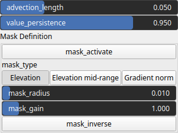

TextureAdvectionWarp Node
=========================

No description available

# Category

WIP/DEPRECATED
# Inputs

|Name|Type|Description|
| :--- | :--- | :--- |
|elevation|VirtualArray|No description|
|input|VirtualTexture|No description|
|mask|VirtualArray|No description|

# Outputs

|Name|Type|Description|
| :--- | :--- | :--- |
|texture|VirtualTexture|No description|

# Parameters

|Name|Type|Description|
| :--- | :--- | :--- |
|advection_length|Float|No description|
|mask_activate|Bool|Enables or disables the internal mask. If the node's 'mask' input is connected, this setting is bypassed and the input mask is used instead.|
|mask_gain|Float|Controls the intensity or influence of the internal mask. Bypassed if the 'mask' input is connected.|
|mask_inverse|Bool|Inverts the internal mask, applying the operator where the mask is low. Ignored if a 'mask' input is provided.|
|mask_radius|Float|Defines the smoothing radius for the internal mask. A value of 0 disables smoothing. This is bypassed if the 'mask' input is used.|
|mask_type|Choice|Specifies how the internal mask is computed: 'Elevation' uses height, 'Gradient Norm' uses slope, and 'Elevation mid-range' selects the middle portion of the height range. This parameter is ignored when a 'mask' input is connected.|
|value_persistence|Float|No description|

# Example

No example available.