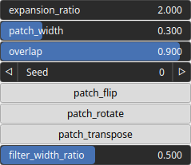

TextureQuiltingExpand Node
==========================

TODO

# Category

Texture
# Inputs

|Name|Type|Description|
| :--- | :--- | :--- |
|heightmap (guide)|VirtualArray|TODO|
|texture (guide)|VirtualTexture|TODO|
|texture A|VirtualTexture|TODO|
|texture B|VirtualTexture|TODO|
|texture C|VirtualTexture|TODO|
|texture D|VirtualTexture|TODO|

# Outputs

|Name|Type|Description|
| :--- | :--- | :--- |
|heightmap|VirtualArray|TODO|
|texture|VirtualTexture|TODO|
|texture A out|VirtualTexture|TODO|
|texture B out|VirtualTexture|TODO|
|texture C out|VirtualTexture|TODO|
|texture D out|VirtualTexture|TODO|

# Parameters

|Name|Type|Description|
| :--- | :--- | :--- |
|expansion_ratio|Float|TODO|
|filter_width_ratio|Float|TODO|
|overlap|Float|TODO|
|patch_flip|Bool|TODO|
|patch_rotate|Bool|TODO|
|patch_transpose|Bool|TODO|
|patch_width|Float|TODO|
|Seed|Random seed number|Random seed number. The random seed is an offset to the randomized process. A different seed will produce a new result.|

# Example

No example available.  
