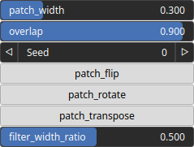

TextureQuiltingShuffle Node
===========================

TODO

## Category

Texture
## Inputs

|Name|Type|Description|
| :--- | :--- | :--- |
|heightmap (guide)|VirtualArray|TODO|
|texture (guide)|VirtualTexture|TODO|
|texture A|VirtualTexture|TODO|
|texture B|VirtualTexture|TODO|
|texture C|VirtualTexture|TODO|
|texture D|VirtualTexture|TODO|

## Outputs

|Name|Type|Description|
| :--- | :--- | :--- |
|heightmap|VirtualArray|TODO|
|texture|VirtualTexture|TODO|
|texture A out|VirtualTexture|TODO|
|texture B out|VirtualTexture|TODO|
|texture C out|VirtualTexture|TODO|
|texture D out|VirtualTexture|TODO|

## Parameters

|Name|Type|Description|
| :--- | :--- | :--- |
|filter_width_ratio|Float|TODO|
|overlap|Float|TODO|
|patch_flip|Bool|TODO|
|patch_rotate|Bool|TODO|
|patch_transpose|Bool|TODO|
|patch_width|Float|TODO|
|Seed|Random seed number|Random seed number. The random seed is an offset to the randomized process. A different seed will produce a new result.|

## Example

Corresponding Hesiod file: [TextureQuiltingShuffle.hsd](../../examples/TextureQuiltingShuffle.hsd). Use [Ctrl+I] in the node editor to import a hsd file within your current project.

!!! note
    Example files are kept up-to-date with the latest version of [Hesiod](https://github.com/otto-link/Hesiod).
    If you find an error, please [open an issue](https://github.com/otto-link/Hesiod/issues).

