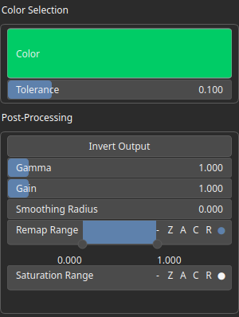

TextureSelectColor Node
=======================

Generates a mask by selecting pixels from the input texture that match a target color within a given tolerance.

# Category

Texture
# Inputs

|Name|Type|Description|
| :--- | :--- | :--- |
|texture|VirtualTexture|Input texture to analyze.|

# Outputs

|Name|Type|Description|
| :--- | :--- | :--- |
|mask|VirtualArray|Output mask where matching pixels are set to 1 and others to 0.|

# Parameters

|Name|Type|Description|
| :--- | :--- | :--- |
|Color|Color|Target color used to select matching pixels.|
|Gain|Float|Mid-centered gain transformation applied to the elevation values. This is a non-linear recurve operator centered around the mid elevation (typically 0.5). Increasing the gain pushes values toward the minimum and maximum elevations, creating flatter low/high regions with a steeper transition around the midpoint.|
|Gamma|Float|Standard gamma correction applied to the elevation values. This is a monotonic power-law remapping that shifts emphasis toward low or high elevations, making the overall shape sharper or bulkier without changing its ordering.|
|Invert Output|Bool|Inverts the output values after processing, flipping low and high values across the midrange.|
|Remap Range|Value range|Linearly remaps the output values to a specified target range (default is [0, 1]).|
|Saturation Range|Value range|Modifies the amplitude of elevations by first clamping them to a given interval and then scaling them so that the restricted interval matches the original input range. This enhances contrast in elevation variations while maintaining overall structure.|
|Smoothing Radius|Float|Defines the radius for post-processing smoothing, determining the size of the neighborhood used to average local values and reduce high-frequency detail. A radius of 0 disables smoothing.|
|Tolerance|Float|Maximum allowed difference between the pixel color and the target color for a match.|

# Example

No example available.  
