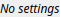

TextureSplitChannels Node
=========================

No description available

# Category

Texture
# Inputs

|Name|Type|Description|
| :--- | :--- | :--- |
|texture|HeightmapRGBA|No description|

# Outputs

|Name|Type|Description|
| :--- | :--- | :--- |
|A|Heightmap|No description|
|B|Heightmap|No description|
|G|Heightmap|No description|
|R|Heightmap|No description|

# Example

No example available.