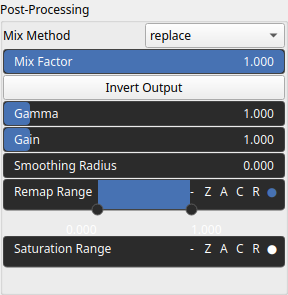

TextureToHeightmap Node
=======================

No description available

# Category

Texture
# Inputs

|Name|Type|Description|
| :--- | :--- | :--- |
|texture|HeightmapRGBA|No description|

# Outputs

|Name|Type|Description|
| :--- | :--- | :--- |
|elevation|Heightmap|No description|

# Parameters

|Name|Type|Description|
| :--- | :--- | :--- |
|post_gain|Float|No description|
|post_inverse|Bool|No description|
|post_remap|Value range|No description|
|post_saturate|Value range|No description|
|post_smoothing_radius|Float|No description|

# Example

No example available.