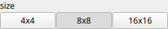

TextureUvChecker Node
=====================

TODO

# Category

Texture
# Outputs

|Name|Type|Description|
| :--- | :--- | :--- |
|texture|VirtualTexture|TODO|

# Parameters

|Name|Type|Description|
| :--- | :--- | :--- |
|size|Choice|TODO|

# Example

No example available.