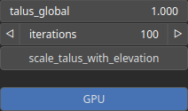

Thermal Node
============

Thermal is an erosion operator used to simulate the process of thermal erosion, which is a type of erosion that occurs due to temperature fluctuations causing the breakdown and movement of soil and rock materials.

# Category

Erosion/Thermal
# Inputs

|Name|Type|Description|
| :--- | :--- | :--- |
|input|Heightmap|Input heightmap.|
|mask|Heightmap|Mask defining the filtering intensity (expected in [0, 1]).|

# Outputs

|Name|Type|Description|
| :--- | :--- | :--- |
|deposition|Heightmap|Deposition map (in [0, 1]).|
|output|Heightmap|Eroded heightmap.|

# Parameters

|Name|Type|Description|
| :--- | :--- | :--- |
|GPU|Bool|Toogle GPU acceleration on or off.|
|iterations|Integer|Number of iterations.|
|scale_talus_with_elevation|Bool|Scales the talus amplitude based on heightmap elevation, reducing it at lower elevations and maintaining the nominal value at higher elevations.|
|talus_global|Float|Repose slope.|

# Example

