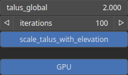

ThermalAutoBedrock Node
=======================

TODO

# Category

Erosion/Thermal
# Inputs

|Name|Type|Description|
| :--- | :--- | :--- |
|input|Heightmap|TODO|
|mask|Heightmap|Mask defining the filtering intensity (expected in [0, 1]).|

# Outputs

|Name|Type|Description|
| :--- | :--- | :--- |
|deposition|Heightmap|Deposition map (in [0, 1]).|
|output|Heightmap|TODO|

# Parameters

|Name|Type|Description|
| :--- | :--- | :--- |
|GPU|Bool|Toogle GPU acceleration on or off.|
|iterations|Integer|TODO|
|scale_talus_with_elevation|Bool|Scales the talus amplitude based on heightmap elevation, reducing it at lower elevations and maintaining the nominal value at higher elevations.|
|talus_global|Float|TODO|

# Example

No example available.