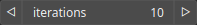

ThermalRib Node
===============

ThermalRib performs thermal erosion using a 'rib' algorithm (taken from Geomorph)

# Category

WIP
# Inputs

|Name|Type|Description|
| :--- | :--- | :--- |
|bedrock|Heightmap|Bedrock elevation, erosion process cannot carve the heightmap further down this point.|
|input|Heightmap|Input heightmap.|

# Outputs

|Name|Type|Description|
| :--- | :--- | :--- |
|output|Heightmap|Eroded heightmap.|

# Parameters

|Name|Type|Description|
| :--- | :--- | :--- |
|iterations|Integer|Number of iterations.|

# Example

