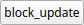
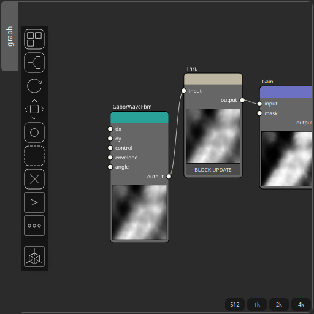

Thru Node
=========

Passes the input heightmap directly to the output without modification.

# Category

Routing
# Inputs

|Name|Type|Description|
| :--- | :--- | :--- |
|input|Heightmap|Input heightmap to be routed unchanged.|

# Outputs

|Name|Type|Description|
| :--- | :--- | :--- |
|output|Heightmap|Output identical to the input heightmap.|

# Parameters

|Name|Type|Description|
| :--- | :--- | :--- |
|block_update|Bool|No description|

# Example

Corresponding Hesiod file: [Thru.hsd](../../examples/Thru.hsd). 

> **Note:** Example files are kept up-to-date with the latest version of [Hesiod](https://github.com/otto-link/Hesiod).
> If you find an error, please [open an issue](https://github.com/otto-link/Hesiod/issues).

