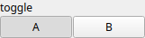

Toggle Node
===========

A routing utility node that outputs either input A or input B based on the value of the 'toggle' parameter. Useful for manually switching between two sources to compare their effect on the final result.

## Category

Routing
## Inputs

|Name|Type|Description|
| :--- | :--- | :--- |
|input A|VirtualArray|First heightmap input. Used when the 'toggle' parameter is true (A).|
|input B|VirtualArray|Second heightmap input. Used when the 'toggle' parameter is false (B).|

## Outputs

|Name|Type|Description|
| :--- | :--- | :--- |
|output|VirtualArray|Selected input passed through: either input A or input B depending on the 'toggle' state.|

## Parameters

|Name|Type|Description|
| :--- | :--- | :--- |
|toggle|Bool|Determines which input is routed to the output.|

## Example

Corresponding Hesiod file: [Toggle.hsd](../../examples/Toggle.hsd). Use [Ctrl+I] in the node editor to import a hsd file within your current project.

!!! note
    Example files are kept up-to-date with the latest version of [Hesiod](https://github.com/otto-link/Hesiod).
    If you find an error, please [open an issue](https://github.com/otto-link/Hesiod/issues).

