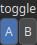

Toggle Node
===========

A routing utility node that outputs either input A or input B based on the value of the 'toggle' parameter. Useful for manually switching between two sources to compare their effect on the final result.

# Category

Routing
# Inputs

|Name|Type|Description|
| :--- | :--- | :--- |
|input A|Heightmap|First heightmap input. Used when the 'toggle' parameter is true (A).|
|input B|Heightmap|Second heightmap input. Used when the 'toggle' parameter is false (B).|

# Outputs

|Name|Type|Description|
| :--- | :--- | :--- |
|output|Heightmap|Selected input passed through: either input A or input B depending on the 'toggle' state.|

# Parameters

|Name|Type|Description|
| :--- | :--- | :--- |
|toggle|Bool|Determines which input is routed to the output.|

# Example

No example available.