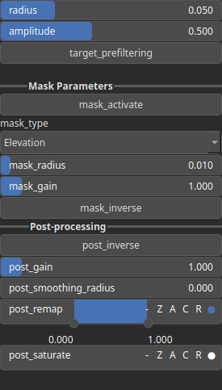
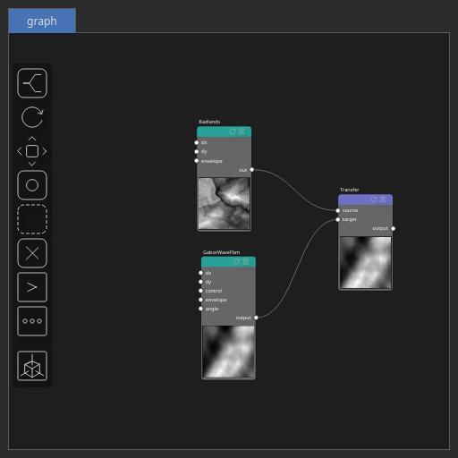

Transfer Node
=============

Blends the high-frequency details of a source heightmap into a target heightmap. A high-pass filter is applied to the source, then its details are scaled and merged with the target, optionally after prefiltering the target for smoother integration.

# Category

Operator/Blend
# Inputs

|Name|Type|Description|
| :--- | :--- | :--- |
|source|Heightmap|Heightmap providing the high-frequency details to transfer.|
|target|Heightmap|Heightmap that serves as the base for blending the source details.|

# Outputs

|Name|Type|Description|
| :--- | :--- | :--- |
|output|Heightmap|Resulting heightmap that combines the target’s base shape with the source’s high-frequency details.|

# Parameters

|Name|Type|Description|
| :--- | :--- | :--- |
|amplitude|Float|Scales the strength of the high-frequency content taken from the source before it is added to the target.|
|mask_activate|Bool|Enables or disables the internal mask. If the node's 'mask' input is connected, this setting is bypassed and the input mask is used instead.|
|mask_gain|Float|Controls the intensity or influence of the internal mask. Bypassed if the 'mask' input is connected.|
|mask_inverse|Bool|Inverts the internal mask, applying the operator where the mask is low. Ignored if a 'mask' input is provided.|
|mask_radius|Float|Defines the smoothing radius for the internal mask. A value of 0 disables smoothing. This is bypassed if the 'mask' input is used.|
|mask_type|Choice|Specifies how the internal mask is computed: 'Elevation' uses height, 'Gradient Norm' uses slope, and 'Elevation mid-range' selects the middle portion of the height range. This parameter is ignored when a 'mask' input is connected.|
|post_gain|Float|Set the gain. Gain is a power law transformation altering the distribution of signal values, compressing or expanding certain regions of the signal depending on the exponent of the power law.|
|post_inverse|Bool|Inverts the output values after processing, flipping low and high values across the midrange.|
|post_remap|Value range|Linearly remaps the output values to a specified target range (default is [0, 1]).|
|post_saturate|Value range|No description|
|post_smoothing_radius|Float|Defines the radius for post-processing smoothing, determining the size of the neighborhood used to average local values and reduce high-frequency detail. A radius of 0 disables smoothing.|
|radius|Float|Radius of the smoothing filter used to separate low and high frequencies when extracting details from the source.|
|target_prefiltering|Bool|If enabled, the target is smoothed before the source details are added, resulting in a softer blend between base and transferred features.|

# Example

Corresponding Hesiod file: [Transfer.hsd](../../examples/Transfer.hsd). Use [Ctrl+I] in the node editor to import a hsd file within your current project. 

> **Note:** Example files are kept up-to-date with the latest version of [Hesiod](https://github.com/otto-link/Hesiod).
> If you find an error, please [open an issue](https://github.com/otto-link/Hesiod/issues).

