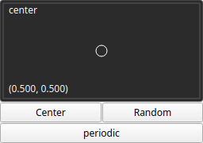

Translate Node
==============

Translates an heightmap by a specified amount along the x and y axes. This function shifts the contents of the input array by `dx` and `dy` units along the x and y axes, respectively. It supports both periodic boundary conditions, where the array wraps around, and non-periodic conditions.

## Category

Operator/Transform
## Inputs

|Name|Type|Description|
| :--- | :--- | :--- |
|dx|VirtualArray|Displacement with respect to the domain size (x-direction).|
|dy|VirtualArray|Displacement with respect to the domain size (y-direction).|
|input|VirtualArray|Displacement with respect to the domain size (x-direction).|

## Outputs

|Name|Type|Description|
| :--- | :--- | :--- |
|output|VirtualArray|Translate heightmap.|

## Parameters

|Name|Type|Description|
| :--- | :--- | :--- |
|center|Vec2Float|No description Coordinates are in domain units; center.y is measured from the bottom of the map (y increases upward).|
|periodic|Bool|If set to `true`, the translation is periodic, meaning that elements that move out of one side of the array reappear on the opposite side.|

## Example

Corresponding Hesiod file: [Translate.hsd](../../examples/Translate.hsd). Use [Ctrl+I] in the node editor to import a hsd file within your current project.

!!! note
    Example files are kept up-to-date with the latest version of [Hesiod](https://github.com/otto-link/Hesiod).
    If you find an error, please [open an issue](https://github.com/otto-link/Hesiod/issues).

