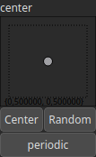

Translate Node
==============

Translates an heightmap by a specified amount along the x and y axes. This function shifts the contents of the input array by `dx` and `dy` units along the x and y axes, respectively. It supports both periodic boundary conditions, where the array wraps around, and non-periodic conditions.

# Category

Operator/Transform
# Inputs

|Name|Type|Description|
| :--- | :--- | :--- |
|dx|Heightmap|Displacement with respect to the domain size (x-direction).|
|dy|Heightmap|Displacement with respect to the domain size (y-direction).|
|input|Heightmap|Displacement with respect to the domain size (x-direction).|

# Outputs

|Name|Type|Description|
| :--- | :--- | :--- |
|output|Heightmap|Translate heightmap.|

# Parameters

|Name|Type|Description|
| :--- | :--- | :--- |
|center|Vec2Float|No description|
|periodic|Bool|If set to `true`, the translation is periodic, meaning that elements that move out of one side of the array reappear on the opposite side.|

# Example

No example available.