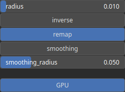

Unsphericity Node
=================

Unsphericity is a measure used to quantify the deviation of the heightmap shape from a perfect sphere. In other words, it indicates how much the terrain differs from being perfectly round or spherical.

# Category

Features/Landform
# Inputs

|Name|Type|Description|
| :--- | :--- | :--- |
|input|Heightmap|Input heightmap.|

# Outputs

|Name|Type|Description|
| :--- | :--- | :--- |
|output|Heightmap|Shape index.|

# Parameters

|Name|Type|Description|
| :--- | :--- | :--- |
|GPU|Bool|Toogle GPU acceleration on or off.|
|inverse|Bool|Toggle inversion of the output values.|
|radius|Float|Filter radius with respect to the domain size.|
|remap|Bool|Remap the operator's output to a specified range, defaulting to [0, 1].|
|smoothing|Bool|Enable or disable smoothing to reduce noise in the curvature computation.|
|smoothing_radius|Float|Specifies the radius for smoothing, determining how much the curvature is averaged over neighboring pixels.|

# Example

No example available.