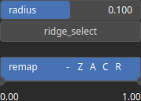

ValleyWidth Node
================

ValleyWidth identifies valley lines and measure the width of the valley at each cross-section.

# Category

Features/Landform
# Inputs

|Name|Type|Description|
| :--- | :--- | :--- |
|input|Heightmap|Input heightmap.|

# Outputs

|Name|Type|Description|
| :--- | :--- | :--- |
|output|Heightmap|Valley width heightmap.|

# Parameters

|Name|Type|Description|
| :--- | :--- | :--- |
|radius|Float|Filter radius with respect to the domain size.|
|remap|Value range|Remap the operator's output to a specified range, defaulting to [0, 1].|
|ridge_select|Bool|If enabled, selects ridges instead of valleys.|

# Example

No example available.