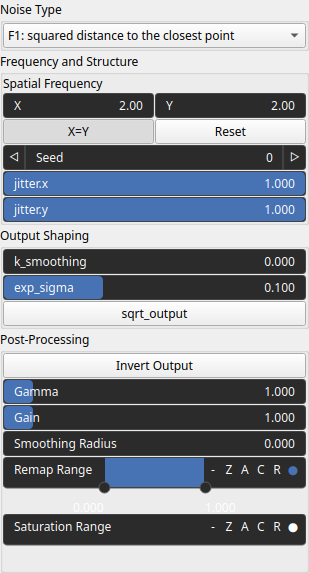

Voronoi Node
============

Generates a Voronoi heightmap based on spatial cell distances, with optional jitter, warping, and control inputs.

# Category

Primitive/Coherent
# Inputs

|Name|Type|Description|
| :--- | :--- | :--- |
|control|Heightmap|Optional input to guide Voronoi jittering.|
|dx|Heightmap|X-axis displacement map for directional warping of the Voronoi pattern.|
|dy|Heightmap|Y-axis displacement map for directional warping of the Voronoi pattern.|
|envelope|Heightmap|Heightmap used to modulate the visibility or strength of the Voronoi pattern.|

# Outputs

|Name|Type|Description|
| :--- | :--- | :--- |
|out|Heightmap|Resulting heightmap generated by the Voronoi algorithm.|

# Parameters

|Name|Type|Description|
| :--- | :--- | :--- |
|inverse|Bool|Toggle inversion of the output values.|
|jitter.x|Float|Amount of random jitter along the X-axis applied to Voronoi seed positions.|
|jitter.y|Float|Amount of random jitter along the Y-axis applied to Voronoi seed positions.|
|k_smoothing|Float|No description|
|kw|Wavenumber|Wavenumber controlling the spatial frequency (cell size) of the Voronoi pattern.|
|remap|Value range|Remaps the output values to a specified target range.|
|return_type|Enumeration|Determines the output type.|
|seed|Random seed number|Seed value for the random generator affecting jitter and cell layout.|
|sqrt_output|Bool|No description|

# Example

