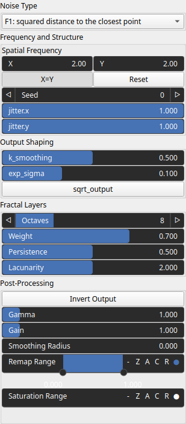

VoronoiFbm Node
===============

Generates a fractal Voronoi pattern using fBm (fractal Brownian motion) based on distance fields and multiple noise layers.

# Category

Primitive/Coherent
# Inputs

|Name|Type|Description|
| :--- | :--- | :--- |
|control|Heightmap|Optional input to guide Voronoi jittering.|
|dx|Heightmap|Displacement map along X-axis to warp the input coordinates.|
|dy|Heightmap|Displacement map along Y-axis to warp the input coordinates.|
|envelope|Heightmap|Optional modulation map to attenuate or mask the fBm pattern locally.|

# Outputs

|Name|Type|Description|
| :--- | :--- | :--- |
|output|Heightmap|Final heightmap result generated by the fBm Voronoi algorithm.|

# Parameters

|Name|Type|Description|
| :--- | :--- | :--- |
|exp_sigma|Float|No description|
|jitter.x|Float|Amount of random jitter applied to seed points along the X-axis.|
|jitter.y|Float|Amount of random jitter applied to seed points along the Y-axis.|
|k_smoothing|Float|No description|
|kw|Wavenumber|Base wavenumber that controls the frequency of the initial Voronoi pattern.|
|lacunarity|Float|Frequency multiplier between successive octaves in the fBm process.|
|octaves|Integer|Number of fBm layers to combine for added detail and complexity.|
|persistence|Float|Amplitude scaling factor applied to each successive octave.|
|post_gain|Float|Set the gain. Gain is a power law transformation altering the distribution of signal values, compressing or expanding certain regions of the signal depending on the exponent of the power law.|
|post_inverse|Bool|Inverts the output values after processing, flipping low and high values across the midrange.|
|post_remap|Value range|Linearly remaps the output values to a specified target range (default is [0, 1]).|
|post_saturate|Value range|Modifies the amplitude of elevations by first clamping them to a given interval and then scaling them so that the restricted interval matches the original input range. This enhances contrast in elevation variations while maintaining overall structure.|
|post_smoothing_radius|Float|Defines the radius for post-processing smoothing, determining the size of the neighborhood used to average local values and reduce high-frequency detail. A radius of 0 disables smoothing.|
|return_type|Enumeration|Defines the type of Voronoi information returned.|
|seed|Random seed number|Seed for random generation, affecting jitter and point distribution.|
|sqrt_output|Bool|No description|
|weight|Float|Weight multiplier applied to the final fBm result for scaling the output.|

# Example

No example available.