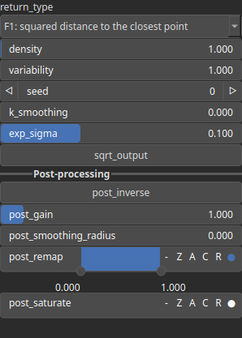

Vororand Node
=============

This function computes a Voronoi diagram or derived metric (such as F1, F2, or edge distances) on a grid of given shape. A set of random points is generated within an extended bounding box, based on the desired density and variability, to reduce edge artifacts. Optionally, per-pixel displacement can be applied through noise fields. Optionnaly, a user-defined set of points can be used instead of automatically generated random points.

# Category

Primitive/Coherent
# Inputs

|Name|Type|Description|
| :--- | :--- | :--- |
|cloud|Cloud|No description|
|dx|Heightmap|No description|
|dy|Heightmap|No description|
|envelope|Heightmap|No description|

# Outputs

|Name|Type|Description|
| :--- | :--- | :--- |
|out|Heightmap|No description|

# Parameters

|Name|Type|Description|
| :--- | :--- | :--- |
|density|Float|No description|
|exp_sigma|Float|No description|
|k_smoothing|Float|No description|
|post_gain|Float|No description|
|post_inverse|Bool|No description|
|post_remap|Value range|No description|
|post_smoothing_radius|Float|No description|
|return_type|Enumeration|No description|
|seed|Random seed number|No description|
|sqrt_output|Bool|No description|
|variability|Float|No description|

# Example

