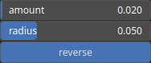

WarpDownslope Node
==================

Warp the heightmap with a direction and amount based on the local downslope.

# Category

WIP
# Inputs

|Name|Type|Description|
| :--- | :--- | :--- |
|input|Heightmap|Input heightmap.|
|mask|Heightmap|Mask defining the filtering intensity (expected in [0, 1]).|

# Outputs

|Name|Type|Description|
| :--- | :--- | :--- |
|output|Heightmap|Filtered heightmap.|

# Parameters

|Name|Type|Description|
| :--- | :--- | :--- |
|amount|Float|Warp scaling with respect to the gradient.|
|radius|Float|Prefiltering radius for gradient computation.|
|reverse|Bool|Reverse warping direction (upslope if true and downslope otherwise).|

# Example

