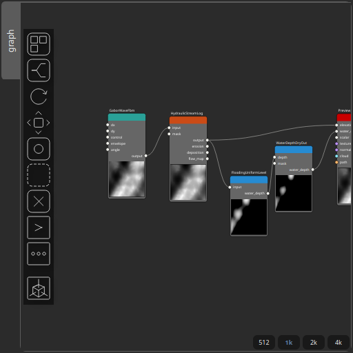

WaterDepthDryOut Node
=====================

Reduces (dries out) the water depth by applying a ratio to the input depth. This can be used to simulate evaporation, infiltration, or partial drying of flooded areas. An optional mask can be provided to control where the drying effect is applied.

# Category

Hydrology
# Inputs

|Name|Type|Description|
| :--- | :--- | :--- |
|depth|VirtualArray|Input water depth values.|
|mask|VirtualArray|Optional mask defining where the drying effect is applied. Unmasked areas remain unchanged.|

# Outputs

|Name|Type|Description|
| :--- | :--- | :--- |
|water_depth|VirtualArray|Output water depth after applying the dry-out ratio.|

# Parameters

|Name|Type|Description|
| :--- | :--- | :--- |
|dry_out_ratio|Float|Ratio applied to the input depth to reduce water. A value of 0 removes all water, while 1 keeps the original depth.|

# Example

Corresponding Hesiod file: [WaterDepthDryOut.hsd](../../examples/WaterDepthDryOut.hsd). Use [Ctrl+I] in the node editor to import a hsd file within your current project. 

> **Note:** Example files are kept up-to-date with the latest version of [Hesiod](https://github.com/otto-link/Hesiod).
> If you find an error, please [open an issue](https://github.com/otto-link/Hesiod/issues).

