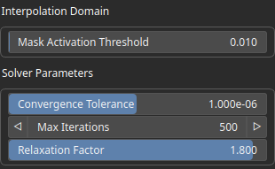
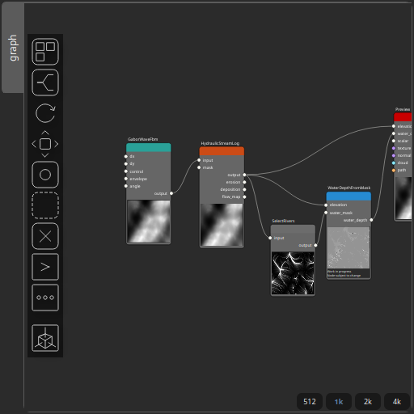

WaterDepthFromMask Node
=======================

Computes water depth over a terrain using a mask to define flooded regions. The method performs a harmonic interpolation (Laplace equation) over the masked domain using a Successive Over-Relaxation (SOR) solver. The resulting water surface is interpolated from boundary conditions, and the water depth is obtained as the difference between this surface and the terrain elevation.

# Category

Hydrology
# Inputs

|Name|Type|Description|
| :--- | :--- | :--- |
|elevation|VirtualArray|Input terrain elevation (height field).|
|water_mask|VirtualArray|Input mask defining where water can accumulate. Values above the threshold indicate flooded regions.|

# Outputs

|Name|Type|Description|
| :--- | :--- | :--- |
|water_depth|VirtualArray|Output water depth map representing flooded areas.|

# Parameters

|Name|Type|Description|
| :--- | :--- | :--- |
|Max Iterations|Integer|Maximum number of SOR iterations used to solve the harmonic interpolation.|
|Mask Activation Threshold|Float|Threshold used to convert the input mask into a binary field. Values above the threshold define flooded regions, while lower values act as boundaries.|
|Relaxation Factor|Float|Relaxation factor for the SOR solver. Values between 1 and 2 are recommended for faster convergence.|
|Convergence Tolerance|Float|Convergence tolerance. The solver stops when the maximum update between iterations falls below this value.|

# Example

Corresponding Hesiod file: [WaterDepthFromMask.hsd](../../examples/WaterDepthFromMask.hsd). Use [Ctrl+I] in the node editor to import a hsd file within your current project. 

> **Note:** Example files are kept up-to-date with the latest version of [Hesiod](https://github.com/otto-link/Hesiod).
> If you find an error, please [open an issue](https://github.com/otto-link/Hesiod/issues).

  
