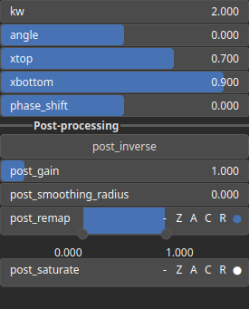

WaveDune Node
=============

WaveDune mimics using a periodic function the formation and spatial distribution of transverse sand dunes on a terrain.

# Category

Primitive/Function
# Inputs

|Name|Type|Description|
| :--- | :--- | :--- |
|dr|Heightmap|Displacement with respect to the domain size (normal direction).|
|envelope|Heightmap|No description|

# Outputs

|Name|Type|Description|
| :--- | :--- | :--- |
|output|Heightmap|WaveDune heightmap.|

# Parameters

|Name|Type|Description|
| :--- | :--- | :--- |
|angle|Float|Angle in the horizontal plane.|
|kw|Float|Noise wavenumbers (kx, ky) for each directions.|
|phase_shift|Float|Phase shift.|
|post_gain|Float|No description|
|post_inverse|Bool|No description|
|post_remap|Value range|No description|
|post_saturate|Value range|No description|
|post_smoothing_radius|Float|No description|
|xbottom|Float|Relative position of the dune bottom, in [0, 1].|
|xtop|Float|Relative position of the dune top, in [0, 1].|

# Example

No example available.