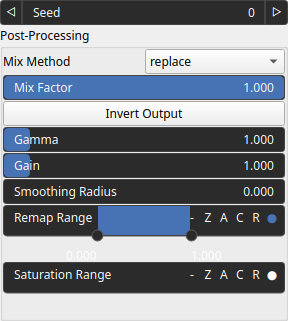

WhiteDensityMap Node
====================

WhiteDensityMap noise operator generates a random signal with a flat power and a spatial density defined by an input heightmap.

# Category

Primitive/Random
# Inputs

|Name|Type|Description|
| :--- | :--- | :--- |
|density|Heightmap|Output noise amplitude envelope.|
|envelope|Heightmap|Output noise amplitude envelope.|

# Outputs

|Name|Type|Description|
| :--- | :--- | :--- |
|output|Heightmap|Generated noise.|

# Parameters

|Name|Type|Description|
| :--- | :--- | :--- |
|inverse|Bool|Toggle inversion of the output values.|
|remap|Value range|Remap the operator's output to a specified range, defaulting to [0, 1].|
|seed|Random seed number|Random seed number.|

# Example

