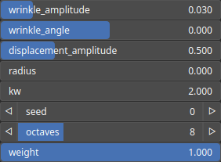

Wrinkle Node
============

TODO

# Category

WIP
# Inputs

|Name|Type|Description|
| :--- | :--- | :--- |
|input|Heightmap|TODO|
|mask|Heightmap|Mask defining the filtering intensity (expected in [0, 1]).|

# Outputs

|Name|Type|Description|
| :--- | :--- | :--- |
|output|Heightmap|TODO|

# Parameters

|Name|Type|Description|
| :--- | :--- | :--- |
|displacement_amplitude|Float|TODO|
|kw|Float|TODO|
|octaves|Integer|TODO|
|radius|Float|TODO|
|seed|Random seed number|TODO|
|weight|Float|TODO|
|wrinkle_amplitude|Float|TODO|
|wrinkle_angle|Float|TODO|

# Example

No example available.