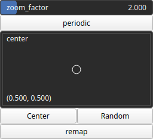

Zoom Node
=========

Applies a zoom effect to an heightmap with an adjustable center. This function scales the input 2D array by a specified zoom factor, effectively resizing the array's contents. The zoom operation is centered around a specified point within the array, allowing for flexible zooming behavior.

## Category

Operator/Transform
## Inputs

|Name|Type|Description|
| :--- | :--- | :--- |
|dx|VirtualArray|Displacement with respect to the domain size (x-direction).|
|dy|VirtualArray|Displacement with respect to the domain size (y-direction).|
|input|VirtualArray|Displacement with respect to the domain size (x-direction).|

## Outputs

|Name|Type|Description|
| :--- | :--- | :--- |
|output|VirtualArray|Zoom heightmap.|

## Parameters

|Name|Type|Description|
| :--- | :--- | :--- |
|center|Vec2Float|Reference center within the heightmap. Coordinates are in domain units; center.y is measured from the bottom of the map (y increases upward).|
|periodic|Bool|If set to `true`, the zoom is periodic.|
|remap|Bool|Remap the operator's output to a specified range, defaulting to [0, 1].|
|zoom_factor|Float|The factor by which to zoom the heightmap.|

## Example

Corresponding Hesiod file: [Zoom.hsd](../../examples/Zoom.hsd). Use [Ctrl+I] in the node editor to import a hsd file within your current project.

!!! note
    Example files are kept up-to-date with the latest version of [Hesiod](https://github.com/otto-link/Hesiod).
    If you find an error, please [open an issue](https://github.com/otto-link/Hesiod/issues).

