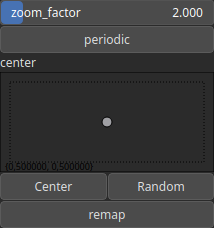

Zoom Node
=========

Applies a zoom effect to an heightmap with an adjustable center. This function scales the input 2D array by a specified zoom factor, effectively resizing the array's contents. The zoom operation is centered around a specified point within the array, allowing for flexible zooming behavior.

# Category

Operator/Transform
# Inputs

|Name|Type|Description|
| :--- | :--- | :--- |
|dx|Heightmap|Displacement with respect to the domain size (x-direction).|
|dy|Heightmap|Displacement with respect to the domain size (y-direction).|
|input|Heightmap|Displacement with respect to the domain size (x-direction).|

# Outputs

|Name|Type|Description|
| :--- | :--- | :--- |
|output|Heightmap|Zoom heightmap.|

# Parameters

|Name|Type|Description|
| :--- | :--- | :--- |
|center|Vec2Float|Reference center within the heightmap.|
|periodic|Bool|If set to `true`, the zoom is periodic.|
|remap|Bool|Remap the operator's output to a specified range, defaulting to [0, 1].|
|zoom_factor|Float|The factor by which to zoom the heightmap.|

# Example

No example available.