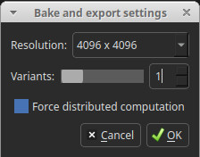
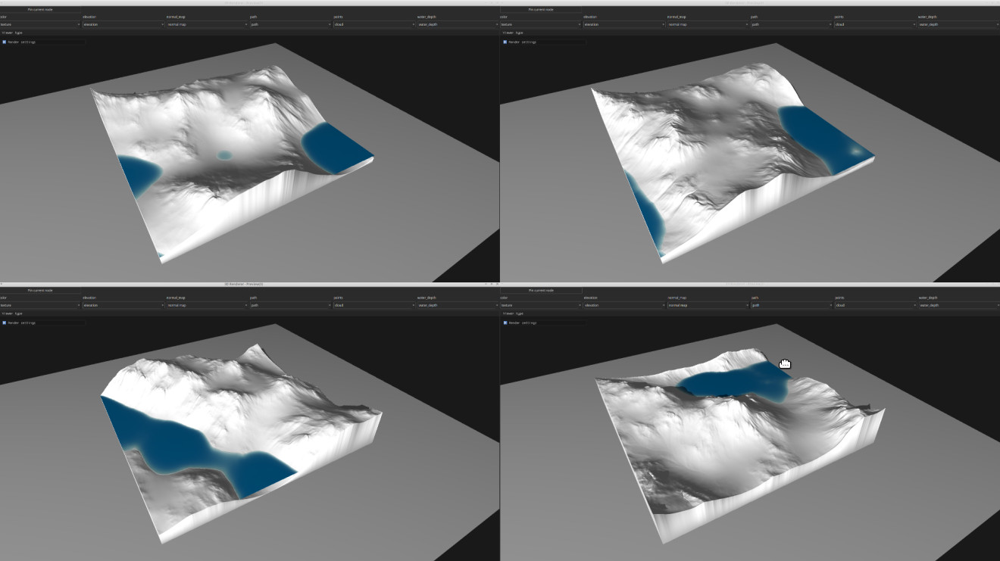

# Bake and Export

The “Bake & Export” feature allows exporting at higher resolutions and supports optional variants by randomizing the seed value before computing the graph nodes. It can be accessed with Alt + E or from the File menu.



### Export Directory Structure

When you perform a bake and export operation, the exported files are organized automatically according to the project name:

- If your project file is named **`my_graph.hsd`**, a directory named **`my_graph_export`** is created.
- This directory contains all exported files.
  - Files are replaced if necessary, but existing files that are not part of the current export are **kept**.

The export structure is organized as follows:
```
    my_graph_export/
    │
    ├── hesiod_bake.hsd # Main exported graph
    ├── [nodeLabel]_[nodeID]_output1.ext # Exported file from node
    ├── [nodeLabel]_[nodeID]_output2.ext # Another exported file from node
    │
    ├── variants.1/ # Variant 1
    │ ├── hesiod_bake.hsd # Graph for variant 1
    │ ├── [nodeLabel]_[nodeID]_output1.ext
    │ ├── [nodeLabel]_[nodeID]_output2.ext
    │ └── ...
    │
    ├── variants.2/ # Variant 2
    │ ├── hesiod_bake.hsd # Graph for variant 2
    │ ├── [nodeLabel]_[nodeID]_output1.ext
    │ ├── [nodeLabel]_[nodeID]_output2.ext
    │ └── ...
    │
    └── ...
```

#### Main Export

- Inside **`my_graph_export`**, a file named **`hesiod_bake.hsd`** is created.
- In this export graph, all nodes marked for export have their `auto_export` property set to **true**, ensuring that output files are generated automatically during graph computation.
- Each exported file name is adjusted and **prefixed with the node’s label and ID** to distinguish outputs from different nodes.
- All exported files are saved directly in the **`my_graph_export`** directory.

#### **Variants**

- Variants are stored in subdirectories named **`variants.n`** (for example, `variants.1`, `variants.2`, etc.) inside **`my_graph_export`**.
- The directory structure inside each variant folder mirrors that of the main export.
- Each variant contains a full export generated with a different seed value.


## What are Variants?

Variants are alternate versions of the same procedural setup. Variants are generated by changing the random seed number while keeping the same procedural algorithm and parameters. This means the overall structure and style remain consistent, but fine details, such as noise patterns or local variations, will differ.


*Example of variants.*
