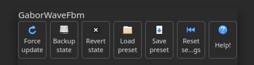

# Node Settings Management – Backup, Revert, Preset, and Reset

This section explains how to manage and restore configuration states for a node using the
available state management buttons: **BackupState**, **RevertState**, **LoadPreset**,
**SavePreset**, and **ResetSettings**.

## Backup and Revert State (Swap Mechanism)

The **BackupState** and **RevertState** buttons work together to provide a **manual
two-slot swap mechanism** for temporary state management during editing.

### How it Works

1. **BackupState**: Saves the current configuration in memory (referred to as the "backup
   slot").
2. **RevertState**: Swaps the current configuration with the one stored in the backup
   slot.

This allows you to toggle between two configurations, which is useful for quickly testing
variations.

### Example

1. Start with a node in **Config1**.
2. Click **BackupState** → Config1 is stored.
3. Modify the node → it becomes **Config2**.
4. Click **RevertState** → node reverts to Config1, and Config2 is now stored.
5. Click **RevertState** again → node reverts to Config2, and Config1 is now stored again.
6. This "swap" can continue back and forth.

### Continuing with New Changes

- If you're happy with Config2, click **BackupState** to overwrite the backup slot with
  Config2.
- Modify the node to reach **Config3**.
- Now, clicking **RevertState** will swap between Config2 and Config3.

## Load and Save Presets

To **permanently store** or share node configurations, use:

- **SavePreset**: Save the current configuration to a data file (e.g., JSON, YAML, or
  another supported format).
- **LoadPreset**: Load a configuration from a file and apply it to the node.

These options are ideal for managing multiple configuration profiles across sessions or
between projects.
