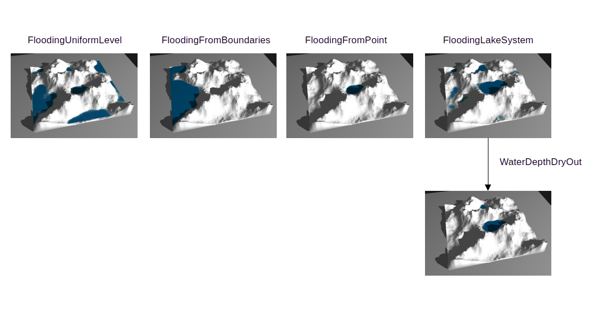
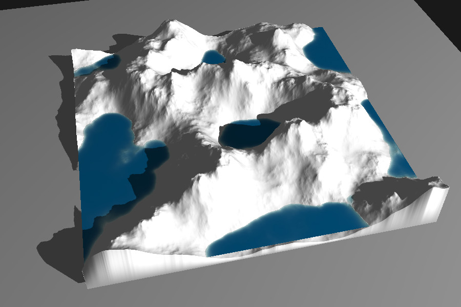
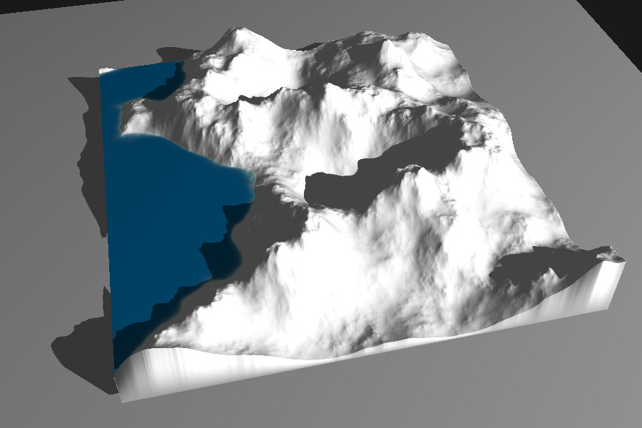
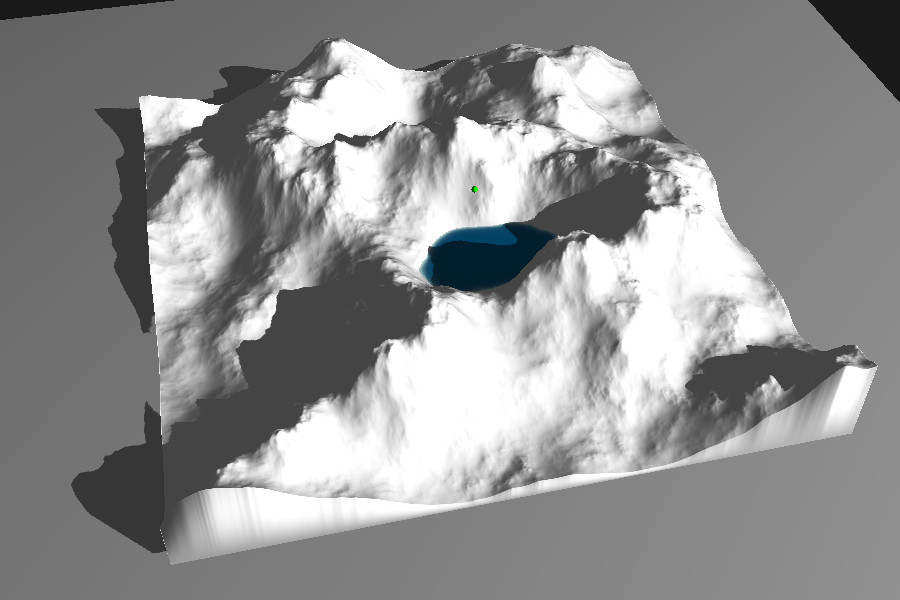
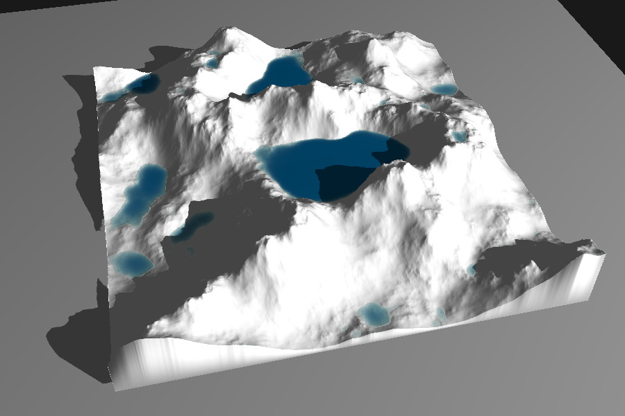

# Hydrology — Flooding Simulation

The flooding module provides a set of functions to simulate the presence and dynamics of
water bodies over a terrain. These algorithms are designed to estimate realistic water
distribution, depth, and drainage behavior from different types of initial conditions
(lakes, rivers, rainfall accumulation, or boundary inflows).

## FloodingUniformLevel

Computes water depth assuming a **uniform flooding level** across the terrain. Each cell’s
depth is the difference between the water level and the local elevation (clamped to zero
when below the terrain).

**Use case:** Simulating global or large-scale flood scenarios, even inland.

## FloodingFromBoundaries

Simulates flooding that starts from the terrain boundaries. This function:

- Identifies the **lowest elevation points** along selected boundary regions.
- Propagates water **inward** from these entry points until a **reference water level** is
  reached.
- Can be used to model coastal flooding, tidal inflows, or boundary-connected lakes.

**Use case:** Estimating inundation zones from sea-level rise or open-boundary reservoirs.

## FloodingFromPoint

Floods the terrain from one or more **seed points**, simulating water spreading outward
until equilibrium. Each seed acts as a localized source of water, rising to the target
level based on local elevation gradients.

**Use case:** Modeling localized flooding events such as rainfall accumulation or
spring-fed basins.

## FloodingLakeSystem

Estimates **lake formation and water depth** by iteratively filling terrain depressions.
The algorithm:

- Detects **topographic basins** (closed catchments).
- Fills them until spillover occurs or a target level is reached.
- Produces a continuous **water depth map** for each lake.

**Use case:** Deriving lake systems.

## WaterDepthDryOut

Applies a **drying factor** to an existing water depth field. This function:

- Multiplies each water depth value by a user-defined `dry_out_ratio` (e.g., 0.1 to reduce
  by 10%).
- Optionally applies drying **only where a mask is non-zero**, allowing selective
  reduction.

**Use case:** Modeling drying of shallow water regions.

## WaterMask

Generates a **binary or smooth mask** representing the presence of water.

There are two main variants:

1. **Binary water mask:** Converts the given water depth field into a binary array, where
   non-zero values indicate water presence.
2. **Smooth transition mask:** Computes a gradual mask of regions that would be flooded if
   the water level increased by a given increment.

**Use case:** Distinguishing land/water areas for texturing for example.

## WaterDepthFromMask

Computes **continuous water depth** over masked terrain regions using **harmonic
interpolation**. This produces a physically plausible water surface consistent with the
surrounding terrain and boundary conditions.

**Use case:** Reconstructing water depth from observed or simulated flood masks, ensuring
smooth water surface gradients.
